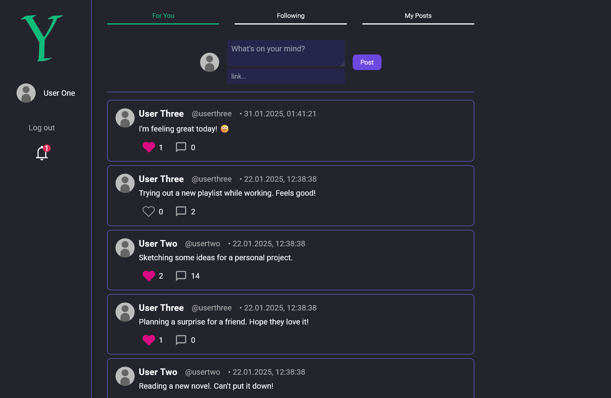

# 'Y' social media app built in Vue.js and Express.js
The app also uses nginx, Socket.io, Passport.js for JWT auth and OrientDB🤔 for data persistence.

Pretty much an X clone. 

### Setup
The app has a dockerfile and docker-compose set up ready to use
. To start the app, place ssl certificate named `y.crt` and `y.key` in `ssl` directory (which must be in the root directory) and run the following command in the root directory:
`docker-compose up`. The app will be available at `https://localhost` and also accessible by other devices on the same network under the IP of the host machine.

The frontend needs .env file with `VITE_API_URL` and `VITE_SOCKETIO_URL` variables pointing to the backend (before building), however it is already included in the repo for convenience as they are only local relative urls used by nginx.

### Features
- User authentication (login, registration) with JWT
- three feeds of posts: For You (mixed following and random), Following and Your Posts
- Post likes, replies
- link posting (with image preview)
- following, muting and blocking users
- instant follow, like and reply notifications
